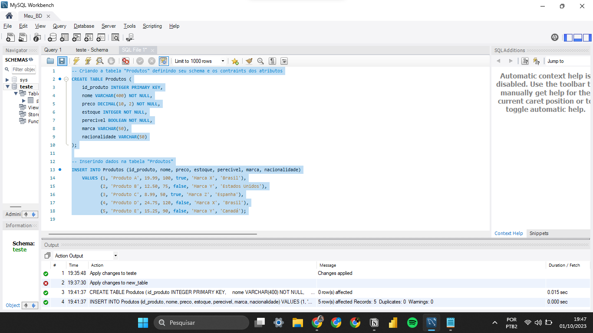

# ExerciciosBancoDeDados-AC2
Exercícios para AC2 da matéria de Banco de Dados do 2º semestre de ADS 

### ETAPA 1:

* Crie uma tabela Produtos com os seguintes itens: id_produto; nome; preço; estoque; perecível; marca; nacionalidade;
* Atribua a cada campo seu respectivo tipo;
* Os itens: nome; preço; estoque; perecível não poderão receber valores nulos;
* O id_produto deve ser utilizado como chave-primaria;
* Após a criação insira cinco produtos, todos devem ter seus respectivos campos
preenchidos;
* Verifique se todos os dados foram inseridos;
* Ao término inicie a segunda etapa

A criação do banco de dados está descrita no arquivo: [Exercicio3_1.sql](Exercicio3_1)

No Workbench:

